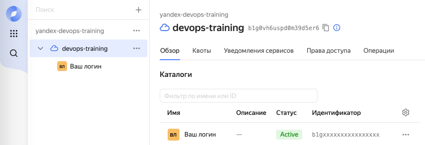

# DevOps-тренировки в Яндексе
Домашнее задание для DevOps-тренировок в Яндексе, лекция "Облако. Кто виноват и что делать."

https://yandex.ru/yaintern/training/devops-training

## Утром пришло письмо
В нашей компании праздник - вчера купили перспективный стартап "CatGPT" - приложение, автоматически улучшающее фотографии путём дорисовывания фотореалистичных котиков. У ребят уже есть рабочий прототип, нужно как можно скорее развернуть его и открыть пользователям.

Сможешь всё сделать, как в лучших домах Лондона и Парижа? Если да, то это четыре динозаврика на ревью. Спасибо!

## Технические моменты
Для решение этой домашнего задания понадобится доступ к Яндекс Облаку. У зарегистрированных участников DevOps-тренировок есть возможность запросить грант в случае необходимости, для этого нужно заполнить форму: https://forms.yandex.ru/surveys/13482710.58cd805f71992dd086d6831888249bb90aa87cb3/

В течение примерно суток после заполнения формы на почту, привязанную к вашему аккаунту Яндекс.ID, придёт письмо от `Yandex Cloud <no-reply@cloud.yandex.ru>` с темой `Вы приглашены в организацию`.
>[!NOTE]
>Если вы забыли свой почтовый адрес, его можно посмотреть, например, на [id.yandex.ru/personal](https://id.yandex.ru/personal#contacts).

Необходимо открыть письмо, перейти по ссылке `Принять приглашение` и завершить регистрацию. В течение нескольких минут в консоли Облака появится облако `devops-training` и персональный каталог, названный вашим логином.

Удостоверьтесь, что доступ предоставлен, перейдя по [ссылке](https://console.cloud.yandex.ru/cloud/b1g0vh6uspd0m39d5er6). Вы должны увидеть подобную картину:



Обязательно переключитесь в ваш персональный folder в облаке devops-training - грант покрывает потребление только в нём.

>[!WARNING]
>По завершении **_обязательно_** сделайте `terraform destroy`. Если не удалить созданные ресурсы - грант на облако будет расходоваться попусту, и его может не хватить для следующих домашних работ.

## Про приложение
По умолчанию приложение поднимает http-сервер на `:8080`

Readyness-проба для балансировщика висит на том же порту: `:8080/ping`

Приложение инструментировано метриками в формате Prometheus, которые по умолчанию можно получить на :9090/metrics.
Например, есть разбивка по дневным и ночным котикам:
```
# HELP enhanced_photo_count by cat type
# TYPE enhanced_photo_count counter
enhanced_photo_count{cat_type="diurnal"} 5
enhanced_photo_count{cat_type="nocturnal"} 1
```
Информацию о кодах ответов приложение отдает в метрике http_response_count
```
# HELP http_response_count by handler and code
# TYPE http_response_count counter
http_response_count{code="200",handler="/",method="post"} 1
http_response_count{code="200",handler="/ping",method="get"} 2
```

## Что нужно сделать.

* Прежде всего нужно залогиниться под своим аккаунтом и форкнуть себе репозиторий. В нём лежат исходники и terraform-инкструкция для разворачивания MVP 


* Написать Dockerfile. Приложение написано на go и собирается стандартным тулчейном:
    ```
    $ go mod download
    $ CGO_ENABLED=0 go build -o path/to/resulting/binary
    ```

    В качестве базового образа для сборки в docker рекомендуем использовать `golang:1.21`; в качестве базового образа для рантайма - `gcr.io/distroless/static-debian12:latest-amd64`

    https://go.dev/doc/tutorial/compile-install

    https://hub.docker.com/_/golang

    https://github.com/GoogleContainerTools/distroless


* Опубликовать получившийся image в Yandex Container Registry (docker push)

    https://cloud.yandex.ru/docs/container-registry/


* Задача со звёздочкой: сделать автосборку с помощью Github CI

    https://docs.github.com/en/actions/publishing-packages/publishing-docker-images


* С помощью Terraform развернуть стенд с приложением:
    - сетевой балансировщик
    - две виртуальных машины под ним

На каждой виртуальной машине должен быть запущен:
1) Контейнер с приложением. Тот самый контейнер, который собирался выше.
2) Unified-Agent. Unified-агент нужно будет настроить на получение метрик от приложения.

    https://cloud.yandex.ru/docs/monitoring/concepts/data-collection/unified-agent/configuration#metrics_pull_input

Важны момент: виртуальные машины обязательно использовать минимальных флейворов:
- Платформа Intel Cascade lake
- 2 vCPU
- Гарантированная доля vCPU 5%
- 1 ГБ RAM
- прерываемая

При решении можно комбинировать различные инструменты - как от Облака, так и сторонние (вроде salt или ansible). Но для полного погружения рекомендуем попробовать развернуть Instance Group на базе Container Optimized Image: https://cloud.yandex.ru/docs/cos/concepts/
https://cloud.yandex.ru/marketplace/products/yc/container-optimized-image

## После того, как стенд готов
* Построить в Yandex Monitoring графики, на которых для сервиса в целом можно будет посмотреть следующее:
    * Разбивку по типам нарисованных котивов (дневных и ночных)
    * Разбивку по кодам ответов, хендлерам и методам
https://cloud.yandex.ru/docs/monitoring/quickstart


* Задача со звёздочкой: дополнительно инструментировать приложение и доработать дашборд для того, чтобы получить графики времён обработки запросов в разрезе handler и method


* Выключить одну из виртуальных машин. Убедиться, что сервис продолжает жить и обслуживать запросы.


>[!WARNING]
>**_Обязательно_** сделать `terraform destroy`. Если не удалить созданные ресурсы - грант на облако будет расходоваться попусту, и его может не хватить для следующих домашних работ.

